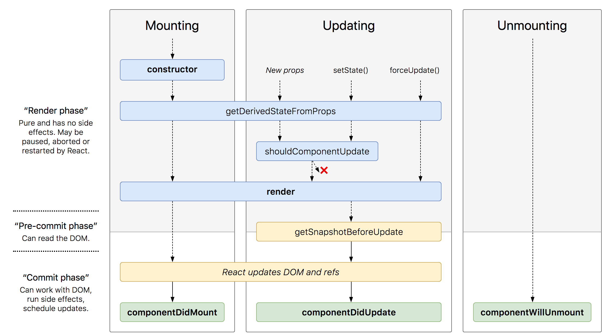

# 7장 컴포넌트의 라이프사이클 메서드


## 라이프사이크 메서드의 이해

* **Will** 어떤 작업 전
* **Did** 작동한 후
* **Mount**, **Update**, **Unmount** 총 세개의 카테고리


### Mount

DOM이 생성되고 웹 브라우저상에 나타나는 것  

컴포넌트 만들기 → contructor → getDerivedStateFromProps  
→ rdner → componentDidMount  


### Mount

* **constructor**  
클래스 생성자

* **getDerivedStateFromProps**  
props에 있는 값을 state에 넣을 때 사용

* **redner**  
UI랜더링

* **componentDidMount**  
컴포넌트가 웹 브라우저 상에 나타난 후 호출


### Update

\[props 변경 | state 변경 | 부모 컴폰너트 리렌더링\]  
→ getDerivedStateFromProps  
→ shouldComponentUpdate  
→ (true 반환 시 redner 호출,  
false 반환시 여기서 작업 취소)  
→ render  
→ getSnapshotBeforeUpdate  
→ (웹 브라우저상의 실제 DOM 변화)  
→ componentDidUpdate


### Update

* **getDerivedStateFromProps**  
마운트 과정, 업데이트가 시작하기전 호출  
props의 변화에 따라 state 값 변화 주고 싶을 때 사용
* **shouldComponentUpdate**  
컴포넌트가 리렌더링 할지 말지 결정  
만약 특정 함수에서 this.forceUpdate()를 호출하면 생략
* **render**  
컴포넌트 리렌더링
* **getSnapshotBeforeUpdate**  
컴포넌트 변화를 DOM에 반영하기 바로 직전 호출
* **componentDidUpdate**  
컴포넌트 업데이트 작업 후


### Unmount

* 언마운트 → componentWillUnmount  
* DOM에서 컴포넌트 제거할 때
* **componentWillUnmount**  
커포넌트가 웹 브라우저상에서 사라지기 전





 
## Detail


### render()

* 컴포넌트 모양 정의
* `this.props`, `this.state`  접근 가능
* 아무것도 보여주고 싶지 않다면 null, false 반환
* 이벤트 설정이 아닌 곳에서 `setState` 및 DOM 접근 금지  
(`componentDidMount`에서 처리)


### constructor(props)

* 생성자
* 초기 state 값 설정


### getDerivedStateFromProps()

* v16.3이후에 만들어짐
* props로 받아온 값을 state에 동기화 시크는 용도
* 컴포넌트 마운트 및 업데이트 때 호출 됨

```js
static getDerivedStateFromProps(nextProps, prevState) {
    // 조거에 따라 특정 값 초기화
    if(nextProps.value !== prevState.value) { 
        return {value: nextProps.value};
    }
    return null; //state 변경이 필요 없으면 null 리턴
}
```


### componentDidMount()

* 컴포넌트를 만들고 첫 렌더링을 마친 후
* 비동기 작업 처리
    * 다른 js라이브러리 또는 프레이웤 함 호출
    * 또는 이벤트 등록, setTimeout, setInterval, 네트워크 요청


### shouldComponentUpdate(nextProps, nextState)

* props 또는 state 변경했을 때 리렌더링 여부 지정 메서드
* 반드시 true or false로 리턴(호출하지 않으면 default true)
* false를 반환하면 업데이트 과정 멈춤
* 상황에 맞춰 리렌더링 방지 가능


### getSnapshotBeforeUpdate(prevProps, prevState)

* v16.3+
* reder로 만들어 진 결과물이 브라우저에 실제로 반영 되기 전 호출
* 반환값은 `componentDidMount`의 세번째 파ㅏㄹ매터로 받음
* 업데이트 직접 참고값 관리용(ex. 스크롤바 위치)


### componentDidMount(prevProps, prevState, snapshot)

* 리렌더링 완료 후 실행
* DOM 관련 처리 무방
* 컴포넌트가 이전에 가졌던 값 접근 가능
* getSnapshotBeforeUpdate 반환값 접근 가능


### componentWillUnmount()

* 컴포넌트를 DOM에서 제거할 때 발생
* 타이머, 이벤트, 직접 생성한 DOM 제거


### componentDidCatch(err, info)

* v16
* 렌더링 도중 에러 캐치
* 어플이 완전히 죽지 않고 오류 UI 보여줄 수 있음
* API호출하여 수집 가능
* this.props.childern의 에러만 잡아냄


## 사용하기


## Error 발생

